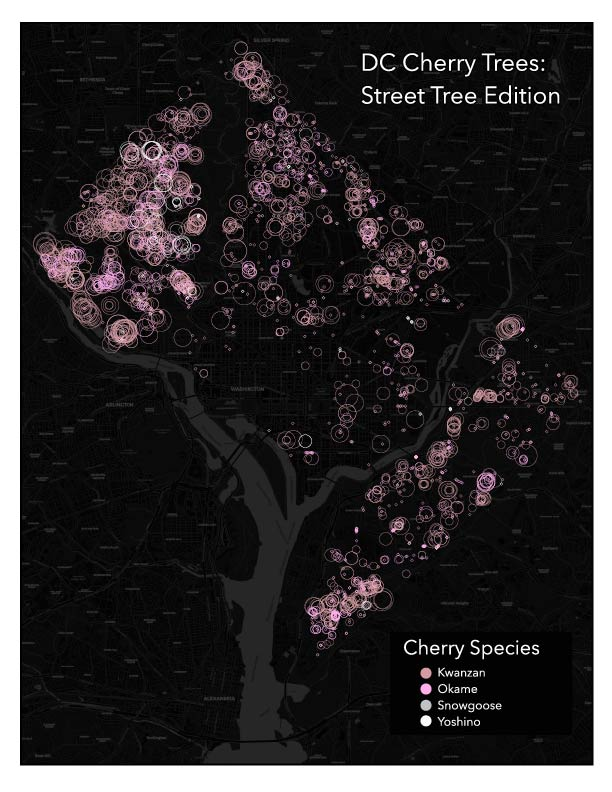

# Introduction

Everybody knows about the cherry trees at the Tidal Basin, and locals know that the National Arboretum also has a large collection of cherry trees, but what if you don't want to dodge tourists or trek out to the arboretum? Just go for a walk! The DC Urban Forestry Administration manages \~3,500 cherry trees within their collection of \~20,000 street trees. In this tutorial, we will pull geospatial data about the locations and types of street trees managed by the city's Urban Forestry Administration from the OpenDataDC portal. We'll then use that data to create a graduated symbol map that will show us the species and size of the cherry trees managed by the city, so you can plan your next cherry blossom walk.

<figure><figcaption>
Example of the map that will be created in this tutorial.
</figcaption></figure>
