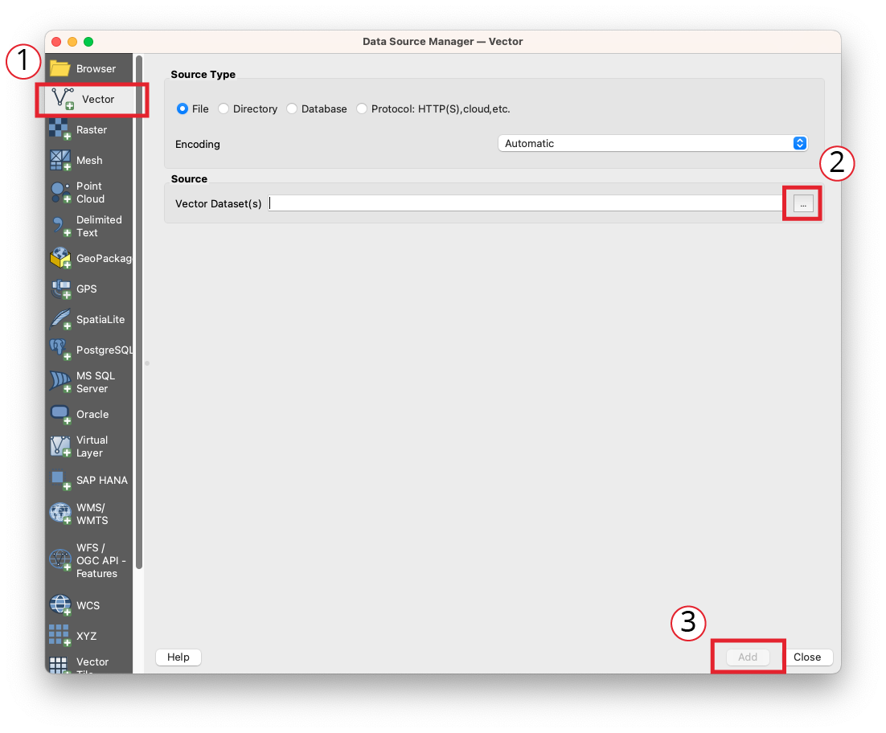

# Adding Data to QGIS

Now we'll add our downloaded street tree data to QGIS. if you're a new QGIS user, it might be helpful to start with taking a quick tour of the graphical user interface (GUI). You'll find an [explanation of the parts of the GUI](https://docs.qgis.org/3.22/en/docs/user\_manual/introduction/qgis\_gui.html) on the QGIS Documentation site.

We'll use the  Data Source Manager to import the GeoJSON file you downloaded previously. You'll find the icon for the Data Source Manager in the tool bar.

1. Click the  Vector icon to open the Vector dialog box.
2. Click the browse button to the right of the **Source** entry to open your file menu and find the cherry\_trees.geojson file we downloaded previsously.
3. Finally, click the Add button to add the geojson to the map.&#x20;

<figure><figcaption></figcaption></figure>

Depending on whether or not you're using the entire street trees dataset or a pre-filtered version, your data should look something like this. (This is pre-filtered data.)&#x20;

Note: QGIS randomly selects colors for visualizing data, so your data will likely be a different color.&#x20;

<figure><figcaption>
Screenshot of pre-filtered street tree data. 
</figcaption></figure>
